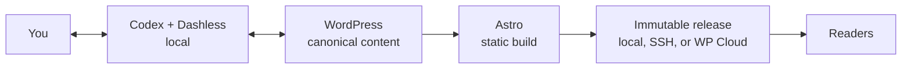

# Dashless

[](https://github.com/RegionallyFamous/dashless/actions/workflows/ci.yml)
[](CHANGELOG.md)
[](LICENSE)

**WordPress without the dashboard.**

Dashless turns local Codex into a conversational WordPress newsroom and Astro into the public website. WordPress remains the canonical store for posts, pages, media, taxonomy, and revisions. Codex becomes the everyday editorial workspace. The result is a fast, owned site with WordPress underneath it—but no requirement to live in `wp-admin`.

The dashboard is not disabled or destroyed. It remains available as a break-glass administration surface. Dashless makes it obsolete for the normal loop of drafting, revising, previewing, publishing, deploying, and restoring content.


> This is a local-first tool, not another publishing SaaS. There is no Dashless cloud account, remote Dashless app, tracking service, or proprietary site runtime.

## The idea

Traditional headless WordPress replaces the public theme but leaves the editorial dashboard as mandatory work. Dashless removes that second half of the bargain:

1. You describe the editorial or design change in Codex.
2. Dashless reads and writes canonical content through the WordPress REST API.
3. It builds the real Astro site locally and opens the exact route for review.
4. After explicit approval, it publishes only the previewed revision.
5. It creates an immutable static release, activates it atomically, and verifies the public result.

Design, preview, deployment, and launch requests never authorize Dashless to invent posts. If WordPress is empty, the site renders an intentional empty state. New writing is created only after an explicit editorial request, and it always begins as a WordPress draft.

## How it works



Dashless consists of three user-owned pieces:

- **The Codex plugin** runs locally, keeps credentials out of chat, performs editorial operations, owns preview locks, generates Astro, and deploys releases.
- **Dashless for WordPress** reports content generations and the site contract. On WP Cloud it also preserves WordPress system routes and serves the active Astro release.
- **The generated Astro project** is ordinary, editable source code. It can be restyled, extended, moved, or deployed without a Dashless account.

Astro is a build dependency, not a production server requirement. On WP Cloud, Node and Astro run locally; WP Cloud receives prebuilt HTML, CSS, JavaScript, images, and release metadata.

## Quick start

### Requirements

- Codex with local plugin support
- macOS or Linux
- Node.js 22.12 or newer and npm
- An HTTPS, single-site WordPress installation with Application Passwords
- For WP Cloud: an existing site plus a key-enabled SSH/SFTP user
- For packaging from source: PHP CLI, `zip`, and `unzip`

The exact tested WordPress, PHP, browser, and operating-system matrix is in [support and compatibility](docs/support.md).

### Build the packages

```sh
git clone https://github.com/RegionallyFamous/dashless.git
cd dashless
npm run release
```

The release command validates the JavaScript and PHP, runs the complete test suite, builds deterministic archives, smoke-tests clean extraction, and writes checksums. It produces:

- `dist/dashless-1.0.0.zip` — the local Codex plugin
- `dist/dashless-wordpress-1.0.0.zip` — the WordPress companion for conventional hosting
- `dist/SHA256SUMS` — release integrity hashes

This repository is also already a valid plugin root; its required entry point is `.codex-plugin/plugin.json`. During development, add the checkout or packaged archive to a local Codex marketplace. OpenAI documents local marketplaces as the development path for testing installable plugins in [Build plugins](https://learn.chatgpt.com/docs/build-plugins).

### Start publishing

Install the Codex plugin, open a new local task, and say:

> Connect my WordPress site to Dashless.

Dashless returns a loopback-only setup URL. That page sends the WordPress Application Password directly to local Dashless storage; the secret never passes through the conversation. On macOS it is stored in Login Keychain. On Linux it is stored in a mode-`0600` file under the platform application-data directory.

Then try:

> Inspect the site and create my Astro frontend in `/path/to/my-site`.

> Open a complete local preview using only the content already published in WordPress.

> Create a draft for a post titled “Hello, open web.”

> Preview the draft on the real site. Do not publish it yet.

> Publish exactly the version I just approved.

For the full first-run and daily flow, see [the complete local workflow](docs/local-workflow.md).

## What ships in 1.0

### Conversational WordPress publishing

- Site inspection, content counts, settings, Page hierarchy, route mapping, companion status, and build freshness
- Posts, nested Pages, categories, tags, media, accessible image metadata, and revisions
- Idempotent draft creation, so a retried request cannot silently duplicate a post
- `modified_gmt` checks that refuse stale overwrites
- Locally staged changes for published content, leaving the live WordPress parent untouched until approval
- Exact revision restoration through the same preview-and-approve contract
- Honest, separately reported states for WordPress save, preview, publication, production build, deployment, and public verification

### An owned Astro publication

- Nested Pages, paginated stories, topic and tag archives, dynamic navigation, and static search
- Mirrored WordPress media and build-generated 1200×630 social cards
- RSS, sitemap, robots, canonical URLs, Open Graph data, structured SEO data, and a real 404 route
- The colorful **Hypertext Diary** theme: late-’90s personal-web energy with modern typography, responsive layouts, day/night palettes, keyboard-visible controls, reduced-motion support, and native cross-document transitions
- No font CDN, client framework, analytics service, image service, or theme account
- A dependency-free production audit covering unsafe markup, metadata, accessibility, internal links, and bundle size
- A reusable site-director skill that teaches another skill-aware agent the WordPress/Astro boundaries, design workflow, three-pass visual QA method, and release criteria

The generated frontend is a starting point, not a cage. Its Astro layouts, components, styles, routes, and social-card composition are yours to change. See [the theme guide](docs/theme.md) for the content mapping and customization points.

### Optional reader signals

The WordPress companion also supplies privacy-minded endpoints that a customized Astro frontend can use:

- A private mailbox that sanitizes and emails a note without creating a public comment
- The **Receiver List**, a double-opt-in, token-unsubscribe email notice for newly published stories with no tracking pixel
- Private, count-free reactions that email one signal and store no reaction record
- Verified Webmentions that remain hidden until the author approves or deletes them through an emailed moderation link

These are server-side building blocks rather than a hosted audience platform. The stock theme keeps them out of the critical publishing path; add only the reader controls your publication needs.

### Release-grade deployment

- Atomic local-directory deployment
- Atomic SSH/rsync deployment to a separate static web root
- First-class WP Cloud deployment inside its single-document-root architecture
- Immutable release directories and SHA-256 file manifests
- Content-generation locking before and after every production build
- Bounded upload retries and safe companion installation or upgrade
- Verification of the exact activated WP Cloud release and WordPress content generation
- Automatic restoration of the previous release when public verification fails
- Explicit one-command WP Cloud rollback without altering WordPress content

## WP Cloud, specifically

Dashless works with WP Cloud by treating Astro as a static compiler, not a second application server:

```text
Local Codex                         Existing WP Cloud site
───────────                         ──────────────────────
WordPress content ──> Astro build ──> wp-content/uploads/dashless/releases/<id>
Dashless companion staged by SFTP ─> wp-content/mu-plugins/dashless-wpcloud.php
Authenticated activation by REST ──> one atomic active-release option
```

The companion keeps `/wp-admin`, `/wp-json`, `/wp-login.php`, cron, and other WordPress system routes working while reader-facing routes receive the active prebuilt Astro files. A candidate release is not activated until every uploaded file matches its manifest and the build's WordPress content generation is still current.

You need:

- an existing WP Cloud/Atomic site;
- a dedicated WordPress Application Password;
- a key-enabled WP Cloud SSH/SFTP user with access to `wp-content`; and
- a public hostname served by that site.

You do **not** need a WP Cloud API key to deploy to an existing site. Site purchasing, provisioning, billing, DNS registration, and domain validation are outside Dashless 1.0. Read [the deployment guide](docs/deployment.md) for paths, routing, preflight checks, aliases, and conventional hosting layouts.

## The publishing safety model

Dashless separates states that ordinary Publish buttons tend to blur:

1. saved in WordPress;
2. preview built;
3. published in WordPress;
4. production build deployed; and
5. public page verified.

An editorial preview records both the WordPress `modified_gmt` value and a SHA-256 digest of the exact stable content fields. Its token is single-use. Publication is refused if the WordPress item changed, the staged payload changed, the preview belongs to another site, or the token was already consumed.

Production builds are also tied to the site's monotonic WordPress content generation. A change to a Post, Page, term, or attachment during the build invalidates it. On WP Cloud, activation verifies the release ID, file manifest, and content generation; failed public verification automatically restores the prior verified release.

WordPress publication and static deployment cannot be one distributed transaction. If WordPress accepts a publication but the build or upload fails, Dashless reports the partial state and leaves the previous static release online. Retrying deployment does not republish or duplicate the post. The complete rules are in [the publishing contract](docs/publishing-contract.md).

## Data ownership and privacy

- WordPress is the sole production source of editorial content.
- The Astro project and every deployment artifact are user-owned files.
- Credentials are never returned in tool results or written into the Astro project.
- Dashless has no telemetry, analytics, advertising, hosted backend, or Dashless account.
- Disconnecting revokes the dedicated Application Password by default and removes site-specific local staging data.
- Disconnecting preserves WordPress content, the Astro project, and deployed static releases.

`DASHLESS_DATA_DIR` overrides local storage for tests or managed environments. `DASHLESS_WORDPRESS_URL`, `DASHLESS_WORDPRESS_USERNAME`, and `DASHLESS_WORDPRESS_APP_PASSWORD` provide an ephemeral CI connection and are never persisted. See [privacy and local data](docs/privacy.md) for exact locations and removal behavior.

## Supported scope

Dashless 1.0 is complete for core Posts, nested Pages, categories, tags, media, revisions, previews, archives, search, builds, and deployment.

It deliberately does not claim support for WooCommerce, multisite, custom post types, arbitrary custom fields, comments, page-builder reconstruction, team approval systems, or unattended scheduled rebuilds. Future-dated WordPress posts cannot trigger a new static build while the local machine and Codex are offline.

When the host permits it, the public Astro site and WordPress should use separate web roots. WP Cloud is the deliberate exception: immutable static releases live under WordPress uploads and the companion safely routes both experiences through the host's single public root.

## Repository map

| Path | Purpose |
|---|---|
| `.codex-plugin/plugin.json` | Installable plugin manifest |
| `server/` | Local MCP server, WordPress client, storage, Astro builds, and deployment |
| `wordpress/` | Installable WordPress companion and WP Cloud static-release bridge |
| `templates/astro/` | Owned Astro starter generated for each connected publication |
| `skills/dashless/` | Editorial operating instructions for Codex |
| `skills/design-dashless-astro-sites/` | Reusable design and frontend QA workflow |
| `tests/` | Protocol, publishing, deployment, WordPress, and real-template tests |
| `docs/` | Operations, architecture, privacy, compatibility, and release documentation |

## Development

The local Dashless server uses only Node.js built-ins. The generated frontend installs its own locked Astro dependencies the first time it is built.

```sh
npm test
npm run check
npm run test:wordpress:playground
npm run release
node skills/design-dashless-astro-sites/scripts/audit-dist.mjs --project /path/to/generated/site
```

- `npm test` runs the Node test suite.
- `npm run check` adds JavaScript and PHP syntax checks.
- `npm run test:wordpress:playground` checks the companion against the committed WordPress Playground fixtures.
- `npm run release` runs the release gate and rebuilds both installable archives plus `SHA256SUMS`.

CI runs the release gate on Linux and macOS, exercises the companion against the oldest and newest supported WordPress versions, and runs WordPress Plugin Check.

## Documentation

- [Complete local workflow](docs/local-workflow.md)
- [Deployment, including WP Cloud](docs/deployment.md)
- [Publishing contract](docs/publishing-contract.md)
- [Hypertext Diary theme](docs/theme.md)
- [Support and compatibility](docs/support.md)
- [Privacy and local data](docs/privacy.md)
- [Release checklist](docs/release-checklist.md)
- [Security policy](SECURITY.md)
- [Changelog](CHANGELOG.md)

Dashless is MIT licensed. Security issues should follow the [private reporting policy](SECURITY.md).
